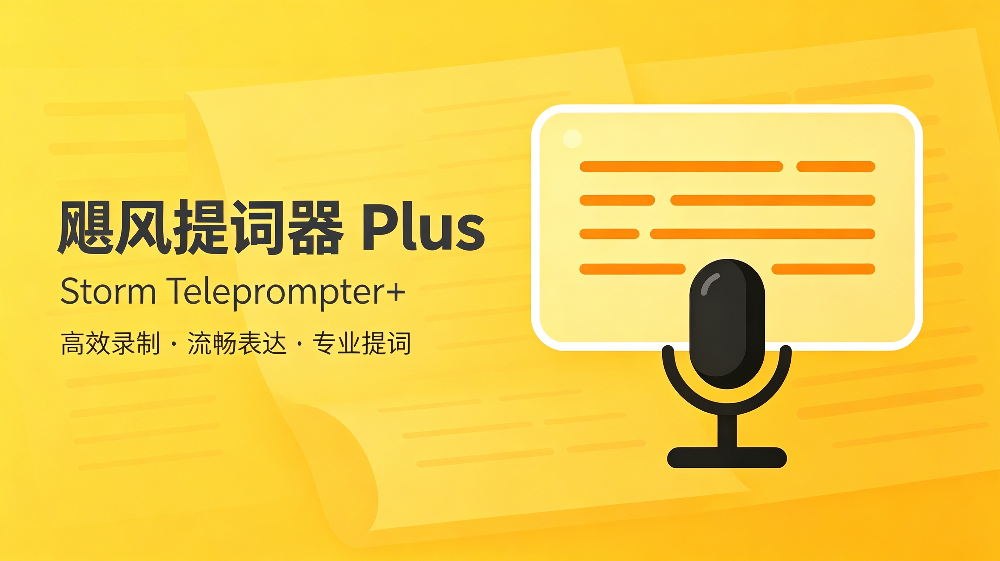

<!--  -->
<!-- <h1 align="center">飓风提词器 Plus</h1> -->
<p align="center"><strong>Storm Teleprompter+</strong></p>

<p align="center"></p>

<p align="center">
  <a href="https://github.com/html5syt/Storm-Teleprompter-Plus/actions/workflows/debug.yml"></a>
  <a href="https://flutter.dev/"></a>
  <a href="https://github.com/html5syt/Storm-Teleprompter-Plus/releases"></a>
  <a href="https://github.com/html5syt/Storm-Teleprompter-Plus/releases"></a>
  <a href="LICENSE"></a>
  <a href="https://github.com/html5syt/Storm-Teleprompter-Plus/stargazers"></a>
</p>

基于 Flutter 开发的跨平台提词器，提供富文本稿件管理、自动滚动、离线语音跟随、分光镜镜像显示，以及局域网多设备同步。

> [!NOTE]
> 本项目源自[影视飓风：AI真的好用吗？影视飓风全新工作流分享！](https://www.bilibili.com/video/BV16woRBfEsH/)中提到的**飓风提词器**，本项目将其从飞书妙搭中解耦，使其可以完全本地运行，并扩展了一些功能。你可以在 [notes/ori_code](notes/ori_code) 中查看原始代码。

## 功能概览

- 文件夹式稿件管理，支持搜索、排序、多选、拖动、复制、移动和层级导入导出。
- Quill 富文本编辑器，支持字体、字号、前景色、背景色和常用文本格式。
- 编辑内容实时保存，可从编辑器直接开始提词。
- 自动滚动模式，滚动速度支持任意非负数值和运行时快速调整。
- 基于 sherpa-onnx 的本地离线语音识别，可按朗读进度自动定位当前字。*（识别准确度和延迟相较受制于web wasm环境而使用int8量化模型的原版更优秀）*
- 中英混合、纯中文和纯英文 ASR 模型选择。
- 正文字号、字体、颜色、背景、边距、阅读框位置和进度条显示设置。
- 镜像翻转正文、阅读框和进度条，适配分光镜。
- 服务端/客户端模式，可在同一局域网内同步稿件、播放状态和当前位置。
- Windows、Android、Linux、macOS、iOS 和 Web 构建工作流。

## 平台说明

| 平台 | 状态 | 说明 |
| --- | --- | --- |
| Windows | 主要测试平台 | 支持本地服务端、麦克风、ASR、文件夹拖放和完整稿件管理 |
| Android | 主要测试平台 | 支持本地服务端、麦克风权限、ASR 和横屏提词 |
| Linux / macOS | CI 构建 | 主要功能已接入，仍需更多设备验证 |
| iOS | CI 无签名构建 | 实际安装需要 Apple Developer 签名和 provisioning profile |
| Web | 未正式支持 | 出于技术限制和性能、开发成本考虑，不提供内置本地后端、原生 ASR、系统字体扫描等原生能力，未经过专门适配。如有需要请使用原版。 |

## 获取应用

可从仓库的 [Releases](https://github.com/html5syt/Storm-Teleprompter-Plus/releases) 页面下载对应平台产物，也可按照[本地运行](#本地运行)章节从源码启动。

## 快速开始

### 1. 创建或导入稿件

在稿件管理主页点击右下角添加按钮：

- **新建稿件**：进入富文本编辑器。
- **新建文件夹**：在当前目录创建子文件夹。
- **导入文件**：批量选择 `.txt` 或 `.docx`。
- **导入文件夹**：批量选择目录并保留原目录层级。

桌面端也可以把多个文件或文件夹直接拖入窗口。导入目录时会保留子文件夹和空文件夹；非 TXT/DOCX 文件会被跳过。

### 2. 编辑稿件

稿件内容会实时保存，无需手动点击保存。编辑器支持：

- 字体、任意字号、文字颜色和背景颜色。
- 加粗、斜体、下划线、删除线、列表和对齐等富文本格式。
- 删除空行、删除段首缩进等格式化工具。
- 查找、替换和全部替换。
- 点击右上角 **开始提词**，保存当前内容并进入播放界面。

### 3. 开始提词

打开稿件后选择播放模式：

- **自动模式**：根据设置的字/分钟速度推进当前字并滚动正文。
- **语音模式**：使用本地麦克风和已下载的 ASR 模型跟随朗读位置。

播放设置中可以调整正文字号、字体、颜色、背景、边距、阅读框位置、进度显示和镜像模式。播放期间为避免定位偏移，字间距和行距只能在暂停时修改。

提词器播放页会自动进入沉浸式显示；退出后恢复普通系统状态栏和窗口状态。

## 稿件管理

- 单击选择，使用 `Ctrl` 或 `Shift` 进行多选。
- 将选中的多个稿件或文件夹拖到目标文件夹或顶部导航路径，可批量移动。
- 右键选择 **移动到文件夹**，可将当前多选内容一次移动到指定目录。
- 支持大图标、小图标、列表和详细信息视图。
- 导出文件夹时会递归保留目录层级；选择嵌套稿件导出时会保留必要的父目录。
- 搜索会覆盖当前目录及其子文件夹。

## 语音跟随

语音模式使用 sherpa-onnx 在本机离线识别，音频和稿件不需要上传到云端。

### 配置步骤

1. 打开 **应用设置 -> 语音识别模型**。
2. 下载或导入一个模型，并确认其已被选为当前模型。
3. 选择系统麦克风；留空时使用系统默认输入设备。
4. 打开稿件，在提词器底部切换到 **语音** 模式。
5. 允许 Android、iOS 或 macOS 的麦克风权限请求。

内置模型包括：

| 模型 | 适用场景 | 下载链接 |
| --- | --- | --- |
| Zipformer 中英双语 | 中英混合稿件和高准确率场景 | [下载](https://github.com/k2-fsa/sherpa-onnx/releases/download/asr-models/sherpa-onnx-streaming-zipformer-bilingual-zh-en-2023-02-20.tar.bz2) |
| Zipformer2 CED 中文 | 中文、低延迟和资源受限设备 | [下载](https://github.com/k2-fsa/sherpa-onnx/releases/download/asr-models/sherpa-onnx-streaming-zipformer-zh-14M-2023-02-23.tar.bz2) |
| Zipformer English | 纯英文演讲和英文低延迟跟随 | [下载](https://github.com/k2-fsa/sherpa-onnx/releases/download/asr-models/sherpa-onnx-streaming-zipformer-en-2023-06-21.tar.bz2) |

模型文件体积较大。下载设置支持系统代理和自定义镜像；解压过程在后台执行。

## 多设备同步

应用默认启动本机服务端，并由本机客户端连接该服务端。需要多设备同步时：

### 服务端设备

1. 打开主页顶部的 **服务连接**。
2. 启用局域网发布。
3. 查看 **服务端连接信息**，记录本机局域网 IP 和端口号。
4. 确认操作系统防火墙允许本应用或对应端口接受局域网连接。

### 客户端设备

1. 确保客户端与服务端处于同一局域网。
2. 打开 **服务连接 -> 连接到远程服务端**。
3. 输入服务端连接信息中显示的任一本机 IP 和端口号。
4. 连接成功后，由服务端开始提词。

服务端会向客户端同步提词会话、稿件、播放状态、模式、滚动速度和当前字位置。连接中断时客户端会持续尝试重连，并允许手动退出播放界面。

常见连接问题：

- 不要填写 `127.0.0.1`、`localhost`、虚拟网卡地址或公网出口地址。
- Windows 网络配置应允许专用网络中的设备访问应用。
- 路由器开启 AP 隔离、访客网络隔离时，同一 Wi-Fi 下的设备也可能无法互通。
- 先使用 `ping` 验证 IP 连通，再检查防火墙和应用显示的端口号。

## 键盘快捷键

### 稿件管理

| 快捷键 | 操作 |
| --- | --- |
| 方向键 | 移动选择 |
| `Enter` | 打开所选文件夹或稿件 |
| `Backspace` / `Alt+↑` | 返回上一级文件夹 |
| `Alt+←` / `Alt+→` | 导航历史后退 / 前进 |
| `Ctrl+A` | 全选 |
| `Ctrl+X` / `Ctrl+C` / `Ctrl+V` | 剪切 / 复制 / 粘贴 |
| `F2` | 重命名 |
| `Delete` | 删除所选内容 |
| `Ctrl+Shift+N` | 新建文件夹 |
| `Esc` | 取消选择 |

### 编辑器

| 快捷键 | 操作 |
| --- | --- |
| `Ctrl+Alt+S` | 保存并开始提词 |
| `Ctrl+F` | 查找 |
| `Ctrl+H` | 查找和替换 |
| `Esc` | 关闭查找面板或返回上一页 |

系统通用的复制、粘贴、撤销、重做和退格操作由编辑器原生处理。

### 提词器

| 快捷键 | 操作 |
| --- | --- |
| `Space` | 开始 / 暂停 |
| 左 `Shift` / 右 `Shift` | 切换自动 / 语音模式 |
| `←` / `→` | 前后移动当前字 |
| `↑` / `↓` | 按可视行移动或调整速度 |
| `Home` / `End` | 跳到稿件开头 / 结尾 |
| `Page Up` / `Page Down` | 向上 / 向下翻一页 |
| `F11` / `Enter` / `Ctrl+Shift+F` | 切换全屏 |
| `Esc` | 退出提词 |

自动播放时滚轮用于调整速度；按住 `Shift` 或 `Ctrl` 可增大调速步长。速度为 0 时，普通滚轮按可视行移动，按住 `Shift` 或 `Ctrl` 后滚轮改为调速。

远程客户端中的位置、模式和播放控制可能由服务端锁定。客户端退出提词前会显示二次警告，退出客户端不会停止服务端会话。

## 本地运行

### 环境要求

你需要具备基本的 Flutter 开发环境和 Android/iOS 构建环境。请参考 [Flutter 官方文档](https://docs.flutter.dev/get-started/install) 进行安装。

- Flutter `3.44.1` stable，或与 `pubspec.yaml` 约束兼容的更新版本。
- Git。
- Android 构建需要 JDK 17、Android SDK 和可用的 Android 设备或模拟器。
- Windows 桌面构建需要 Visual Studio，并安装 **Desktop development with C++** 工作负载。

### 获取代码

```powershell
git clone https://github.com/html5syt/Storm-Teleprompter-Plus.git
cd Storm-Teleprompter-Plus
flutter pub get
```

### 运行

```powershell
# Windows
flutter run -d windows

# 查看设备后运行 Android
flutter devices
flutter run -d <device-id>
```

### 测试与检查

```powershell
flutter analyze --no-pub
flutter test --no-pub
```

## 构建

仓库提供了 VS Code Build Tasks，也可以使用统一 PowerShell 脚本。Debug 构建会把当前 Git commit 的 8 位短哈希写入应用版本信息。

```powershell
# Windows Debug
powershell -ExecutionPolicy Bypass -File tool/flutter_build.ps1 `
  -Target windows -Mode debug

# 分架构 Android Debug APK
powershell -ExecutionPolicy Bypass -File tool/flutter_build.ps1 `
  -Target apk -Mode debug

# Windows Release
powershell -ExecutionPolicy Bypass -File tool/flutter_build.ps1 `
  -Target windows -Mode release -Version v1.0.0

# 分架构 Android Release APK
powershell -ExecutionPolicy Bypass -File tool/flutter_build.ps1 `
  -Target apk -Mode release -Version v1.0.0
```

Android Release 签名配置和 GitHub Secrets 说明见 [Android 发布签名文档](notes/docs/android-release-signing.md)。不要提交密钥库、`android/key.properties` 或任何密码。

## 自动发布

GitHub Actions 可以构建 Android、Windows、Linux、Web、macOS 和未签名 iOS 产物。

- Commit message 包含以下元数据时，使用第一行作为 Release 标题：

  ```text
  [release ver="v1.0.0",pre=false,draft=false]
  ```

- 推送 `v1.0.0` 格式的 tag 时，会创建 `draft=true`、`prerelease=false` 的 Release。

Android Release 构建需要先配置仓库 Secrets，详情见 Android 签名文档。

## 开发&构建常见问题

### Windows 或 Android 首次构建下载失败

Flutter、Gradle、Maven 和模型文件都可能需要访问外部下载源。请先确认代理配置可用于当前终端；不要把临时镜像地址或密码提交到仓库。

### Windows 出现 Kotlin incremental cache 错误

仓库已在 `android/gradle.properties` 中关闭 Kotlin 增量编译以规避缓存锁问题。如果本机仍保留损坏缓存，请先关闭正在运行的 Gradle/Flutter 构建进程，再执行：

```powershell
flutter clean
flutter pub get
```

随后重新构建，不要同时启动多个 Android Gradle 构建。

### 语音模式没有声音输入

- 确认操作系统已允许应用访问麦克风。
- 在应用设置中明确选择实际输入设备，或检查系统默认设备是否有效。
- 关闭独占占用麦克风的其他应用。
- Android 设备应在系统权限设置中允许麦克风权限。

## 参与开发

提交改动前请至少运行：

```powershell
dart format lib test
flutter analyze --no-pub
flutter test --no-pub
```

页面不应直接访问持久化服务。UI 通过 Provider 读取状态，Provider 通过 `ConnectionProvider` 与本地或远程后端通信。ASR 音频采集、识别器生命周期、文本对齐和提词器播放状态应保持职责分离。

## License & Disclaimer

本项目采用 [MIT License](LICENSE)。

绝大部分代码由Codex编写，存在部分潜在不当实现或安全漏洞。如有发现，请提交 Issue 或 Pull Request。

如果你有新功能建议、Bug 报告或其他反馈，请在 [GitHub Issues](https://github.com/html5syt/Storm-Teleprompter-Plus/issues) 中提交。

<h2 style="text-align: right;">Mr. Tim 2026.7</h2>
