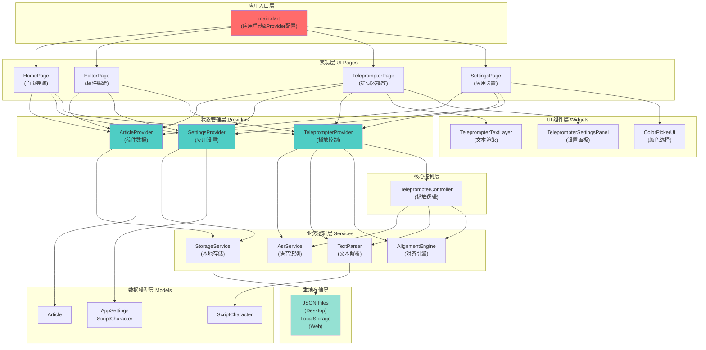
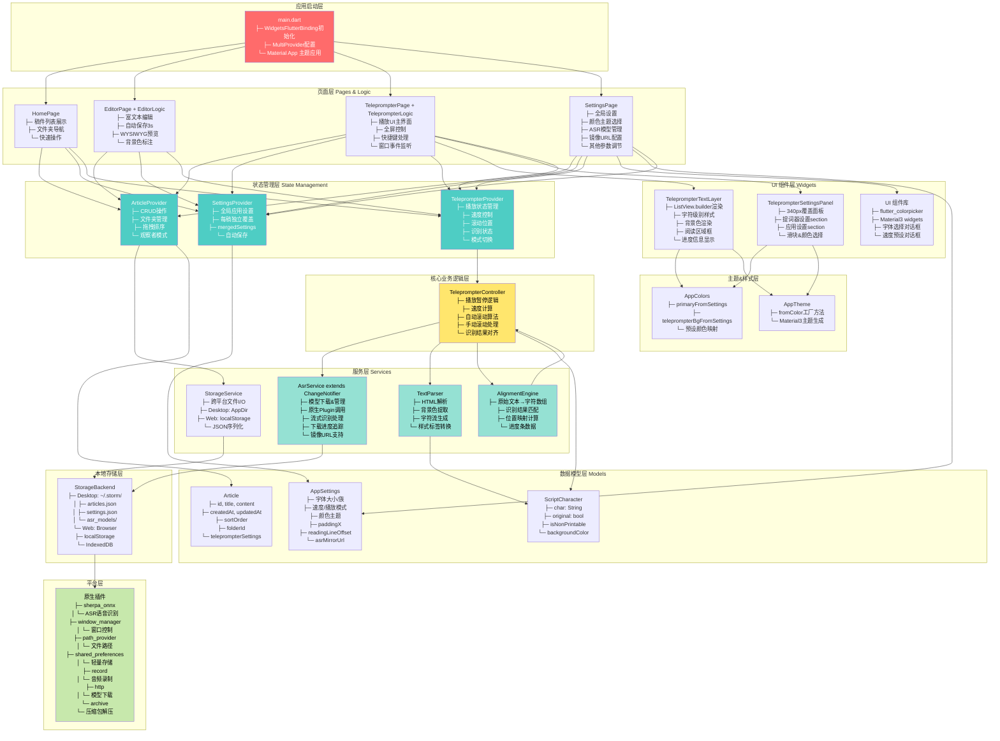

# Storm Teleprompter Plus (Flutter) - 系统架构

## 简洁版架构图



---

## 详细版架构图



---

## 架构说明

### 层级设计

| 层级            | 职责                         | 示例                                                    |
| --------------- | ---------------------------- | ------------------------------------------------------- |
| **应用启动层**  | 应用初始化、Provider全局配置 | main.dart                                               |
| **页面层**      | UI布局与用户交互             | HomePage, EditorPage, TeleprompterPage                  |
| **状态管理层**  | 业务状态存储与观察者模式     | ArticleProvider, SettingsProvider, TeleprompterProvider |
| **核心逻辑层**  | 提词器播放算法实现           | TeleprompterController                                  |
| **服务层**      | 独立的业务功能封装           | StorageService, AsrService, TextParser, AlignmentEngine |
| **数据模型层**  | 业务数据结构定义             | Article, AppSettings, ScriptCharacter                   |
| **UI组件层**    | 可复用的UI组件               | TeleprompterTextLayer, TeleprompterSettingsPanel        |
| **主题&样式层** | 应用主题与色彩系统           | AppColors, AppTheme                                     |
| **本地存储层**  | 数据持久化                   | JSON文件(Desktop)、localStorage(Web)                    |
| **平台层**      | 跨平台原生能力               | sherpa_onnx, window_manager, path_provider等            |

### 关键组件详解

#### 1. **提词器播放核心** (TeleprompterController)
- **功能**: 驱动文本自动滚动、速度计算、识别结果对齐
- **输入**: 当前速度、播放状态、识别文本、时间戳
- **输出**: 应滚动位置、进度百分比、下一次更新的延迟时间

#### 2. **状态管理三角形**
- **ArticleProvider**: 稿件的CRUD、文件夹树结构、拖拽排序
- **SettingsProvider**: 全局设置 + 每稿覆盖层（mergedSettings）
- **TeleprompterProvider**: 播放状态、速度、识别模式、识别结果缓存

#### 3. **本地存储策略**
- **Desktop (Windows/macOS/Linux)**: 用户目录下 `~/.storm/` 的JSON文件
- **Web**: 浏览器 `localStorage` + `IndexedDB`（大文件）
- **StorageService**: 统一接口，自动选择平台实现

#### 4. **语音识别流程**
```
1. 用户点击 "自动识别" → TeleprompterProvider.startRecognition()
2. AsrService 加载已选模型 (sherpa_onnx 原生插件)
3. 音频流以PCM块形式输入 → 识别器持续处理
4. 识别结果通过 AlignmentEngine 映射到原文本位置
5. TeleprompterTextLayer 实时高亮已读部分
```

#### 5. **颜色主题系统**
- 用户在SettingsPage选择主题色 → AppColors.primaryFromSettings() 转换
- main.dart Consumer 包装器监听SettingsProvider → 主题重建
- 所有页面使用 `AppColors.primary` 而非硬编码颜色

#### 6. **编辑器特性**
- **自动保存**: 3秒防抖，后台保存到本地存储
- **WYSIWYG模式**: Toggle按钮切换 RichText预览 vs 源码编辑
- **背景色标注**: TextParser解析HTML `<span style="background-color:...">` 标签

#### 7. **提词器设置面板**
- **位置**: 右侧覆盖面板 (340px宽)，不需要页面跳转
- **分区**: 
  - 上部: 提词器播放相关 (字体、速度、模式、滚动参数)
  - 下部: 应用级设置 (主题、ASR、镜像)
- **每稿独立**: 稿件可覆盖全局设置参数

---

## 数据流示例

### 场景 1: 新建稿件 → 编辑 → 提词
```
HomePage 
  → 新建按钮 
  → EditorPage(article: null) 
  → ArticleProvider.addArticle()
  → StorageService 保存
  → TeleprompterPage 加载
  → TeleprompterController 开始播放
```

### 场景 2: 自动识别流程
```
TeleprompterPage (播放中)
  → TeleprompterProvider.startRecognition()
  → AsrService.recognize() (原生Plugin)
  → 识别结果回调 → AlignmentEngine.align()
  → 计算高亮位置 → TeleprompterTextLayer 重绘
```

### 场景 3: 修改颜色主题
```
SettingsPage
  → 颜色选择器
  → SettingsProvider.setUiPrimaryColor()
  → AppSettings 保存
  → StorageService.saveSettings()
  → main.dart Consumer 触发重建
  → MaterialApp 应用新主题
```

---

## 跨平台适配

| 功能         | Windows        | macOS          | Linux          | Web          |
| ------------ | -------------- | -------------- | -------------- | ------------ |
| **文件存储** | AppData\Local  | ~/Library      | ~/.config      | localStorage |
| **窗口管理** | window_manager | window_manager | window_manager | ❌            |
| **语音识别** | sherpa_onnx    | sherpa_onnx    | sherpa_onnx    | ⚠️ WASM Stub  |
| **全屏模式** | ✓              | ✓              | ✓              | ✓            |
| **模型下载** | ✓              | ✓              | ✓              | ❌ (静态资源) |

---

## 关键设计决策

1. **Provider 而非 Riverpod**: 相对轻量，易于学习与维护
2. **ListView.builder**: 支持2000+字符的流畅渲染
3. **ChangeNotifier 在 AsrService**: 下载进度可观察，SettingsPage 可显示进度条
4. **mergedSettings**: 优雅支持全局 + 每稿覆盖的设置系统
5. **TextParser + ScriptCharacter**: 清晰的字符级元数据模型
6. **Platform-aware Downloader**: 工厂模式自动选择 Desktop/Web 实现

---

## 性能优化点

- ✅ ListView.builder 而非 SingleChildScrollView（减少内存占用）
- ✅ 3秒防抖自动保存（避免频繁IO）
- ✅ Provider 的部分重建机制（只更新关联Widget）
- ✅ 原生Plugin调用 (sherpa_onnx) 性能更优

