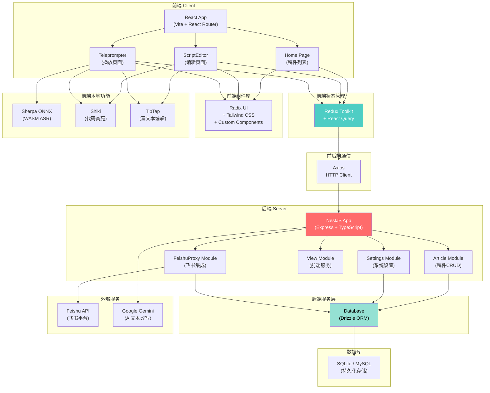
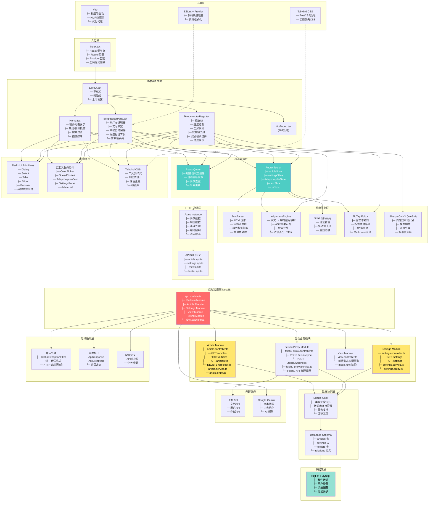

# 原始飓风提词器 (React + NestJS) - 系统架构

## 简洁版架构图



---

## 详细版架构图



---

## 架构说明

### 前端架构（React + Vite）

#### 层级设计
| 层级            | 职责                                | 示例                                       |
| --------------- | ----------------------------------- | ------------------------------------------ |
| **入口层**      | React根组件、路由配置、全局Provider | index.tsx                                  |
| **路由/页面层** | 独立页面组件与用户交互              | Home, ScriptEditor, Teleprompter           |
| **状态管理**    | 全局状态存储与同步                  | Redux Toolkit + React Query                |
| **UI组件**      | 可复用UI组件库                      | Radix + Tailwind + 自定义组件              |
| **服务层**      | 业务逻辑与数据处理                  | TextParser, AlignmentEngine, Shiki, TipTap |
| **HTTP通信**    | API调用与请求管理                   | Axios + API接口定义                        |

#### 核心前端库
- **Vite**: 极速开发服务器 + 优化构建
- **React Router**: 声明式路由管理
- **Redux Toolkit**: 可预测的全局状态
- **React Query**: 服务器状态缓存同步
- **Radix UI**: 无样式可访问原始组件
- **Tailwind CSS**: 工具优先的CSS框架
- **TipTap**: 强大的富文本编辑器
- **Shiki**: 高精度代码语法高亮
- **Sherpa ONNX (WASM)**: 浏览器本地语音识别

---

### 后端架构（NestJS + Express）

#### 模块化设计
```
AppModule (根模块)
├─ PlatformModule (飞书AaaS平台能力)
├─ ArticleModule
│  ├─ ArticleController (路由)
│  ├─ ArticleService (业务逻辑)
│  └─ Article Entity (数据模型)
├─ SettingsModule
│  ├─ SettingsController
│  ├─ SettingsService
│  └─ Settings Entity
├─ FeishuProxyModule
│  ├─ FeishuProxyController (API代理)
│  ├─ FeishuProxyService (飞书SDK调用)
│  └─ 飞书事件处理
├─ ViewModule (前端静态资源+MPA路由)
└─ 全局过滤器、中间件、拦截器
```

#### API 设计规范
```typescript
// 统一响应格式
{
  "code": 200,           // 业务状态码
  "data": {...},         // 业务数据
  "message": "success"   // 说明文本
}

// 分页格式
{
  "code": 200,
  "data": {
    "items": [...],
    "total": 100,
    "page": 1,
    "pageSize": 10
  }
}
```

#### 数据库设计
- **articles 表**: id, title, content, createdAt, updatedAt, folderId
- **settings 表**: key, value, type, description
- **folders 表**: id, name, parentId, sortOrder

---

### 关键特性详解

#### 1. **文本对齐引擎 (AlignmentEngine)**
功能：ASR识别结果与原始文本的位置映射
```
原始文本: "今天天气很好，我们一起去公园"
ASR结果: "今天天气很好 我们一起去公园"
           ↓ 对齐
映射数组: [
  { char: '今', position: 0, recognized: true },
  { char: '天', position: 1, recognized: true },
  ...
]
进度: 12/20 (60%)
```

#### 2. **富文本编辑器 (TipTap)**
- 基于 ProseMirror 的强大富文本引擎
- 扩展系统: 可定制颜色、背景、样式
- Markdown 导入导出支持

#### 3. **飞书集成 (FeishuProxy)**
- OAuth认证与授权
- 双向同步: 文档<→>稿件
- Webhook事件推送

#### 4. **Google Gemini AI**
- 文本改写与优化
- 内容生成与补全

#### 5. **状态管理三层**
```
1. 组件本地状态 (useState) - 临时UI状态
2. Redux全局状态 - 跨组件共享数据
3. React Query 缓存 - 服务器同步状态
```

---

### 数据流示例

#### 场景1: 新建稿件
```
Home.tsx (新建按钮)
  → 打开对话框
  → 提交表单
  → articleApi.createArticle()
  → POST /api/articles
  → ArticleService.create()
  → Database.insert()
  → Redux dispatch (addArticle)
  → Home列表重新渲染
```

#### 场景2: 编辑稿件
```
ScriptEditor.tsx (用户输入)
  → 3s防抖
  → articleApi.updateArticle()
  → PUT /api/articles/:id
  → ArticleService.update()
  → Database.update()
  → React Query invalidate
  → 同步回主列表
```

#### 场景3: ASR识别
```
TeleprompterPage (播放中)
  → Sherpa ONNX 识别完成
  → AlignmentEngine.align()
  → 计算字符高亮范围
  → Redux dispatch (updateRecognition)
  → TeleprompterView 重绘
  → 选项1: 发送识别结果到后端 (articleApi.updateRecognition)
  → 选项2: 纯前端处理 (保存到本地)
```

#### 场景4: 飞书同步
```
SettingsPanel (开启飞书同步)
  → POST /api/feishu/sync
  → FeishuService.fetchDocuments()
  → Feishu API 返回文档列表
  → 转换为 Article 数据模型
  → Database.insert()
  → Redux 更新列表
```

---

## 技术栈总结

### 前端
| 分类   | 技术          | 版本       |
| ------ | ------------- | ---------- |
| 框架   | React         | 18.x       |
| 构建   | Vite          | 5.x        |
| 路由   | React Router  | 6.x        |
| 状态   | Redux Toolkit | 2.x        |
| 缓存   | React Query   | 5.x        |
| UI原始 | Radix UI      | 1.x        |
| 样式   | Tailwind CSS  | 4.x        |
| 编辑器 | TipTap        | 3.x        |
| 高亮   | Shiki         | 3.x        |
| ASR    | Sherpa ONNX   | 1.x (WASM) |

### 后端
| 分类   | 技术            | 版本   |
| ------ | --------------- | ------ |
| 框架   | NestJS          | 10.x   |
| 运行时 | Node.js         | 20.x   |
| 数据库 | SQLite/MySQL    | -      |
| ORM    | Drizzle         | 0.44.x |
| HTTP   | Express         | 4.x    |
| 验证   | class-validator | 0.14.x |
| AI     | Google Gemini   | API    |
| 飞书   | @lark-apaas     | 1.x    |

---

## 部署架构

```
生产环境
├─ 前端
│  ├─ Vite build 输出 (dist/)
│  └─ 静态资源 CDN 分发
└─ 后端
   ├─ NestJS 应用实例
   ├─ 数据库 (MySQL主从/PostgreSQL)
   └─ 消息队列 (可选，用于异步任务)
```

---

## 跨平台差异

| 功能     | 桌面网页 | 手机网页 | 说明              |
| -------- | -------- | -------- | ----------------- |
| 完整编辑 | ✓        | ⚠️        | 手机UI需优化      |
| 提词播放 | ✓        | ✓        | 响应式设计        |
| ASR识别  | ✓        | ✓        | WASM跨平台        |
| 飞书集成 | ✓        | ⚠️        | 部分功能需OAuth   |
| 模型管理 | ✓        | ❌        | Web不支持本地下载 |

