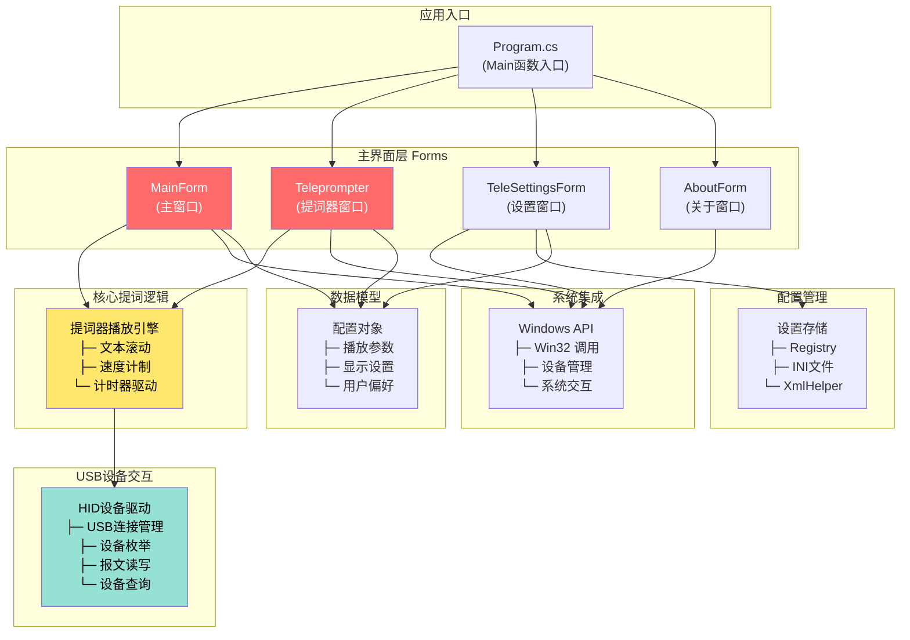

# TYteleprompt (.NET WinForms) - 系统架构

## 简洁版架构图



---

## 详细版架构图

```mermaid
graph TB
    subgraph "应用启动层"
        ENTRY["Program.cs<br/>├─ static Main(string[] args)<br/>├─ 应用程序启动<br/>├─ MainForm 创建<br/>└─ Application.Run()"]
    end
    
    subgraph "主界面层 (Forms)"
        MAIN["MainForm.cs / MainForm.Designer.cs<br/>├─ 主窗口容器<br/>├─ 菜单栏<br/>│  ├─ File (打开、保存、退出)<br/>│  ├─ Edit (编辑操作)<br/>│  ├─ View (显示选项)<br/>│  └─ Help (帮助、关于)<br/>├─ 工具栏<br/>│  ├─ 新建、打开、保存<br/>│  ├─ 播放、暂停、停止<br/>│  ├─ 速度调节<br/>│  └─ 字体选择<br/>├─ 文本编辑区 (RichTextBox)<br/>├─ 状态栏<br/>└─ resource: MainForm.resx"]
        
        TELEPROMPTER["Teleprompter.cs / Teleprompter.Designer.cs<br/>├─ 提词器显示窗口<br/>├─ 全屏控制<br/>├─ 文本渲染<br/>│  ├─ 字体配置<br/>│  ├─ 字号设置<br/>│  ├─ 行距控制<br/>│  └─ 颜色方案<br/>├─ 播放控制 (隐藏时显示)<br/>├─ 实时滚动更新<br/>└─ resource: Teleprompter.resx"]
        
        SETTINGS["TeleSettingsForm.cs / TeleSettingsForm.Designer.cs<br/>├─ 设置对话框<br/>├─ 标签页结构<br/>│  ├─ 基本设置<br/>│  │  ├─ 字体选择<br/>│  │  ├─ 字号调节 Spinner<br/>│  │  └─ 行距设置<br/>│  ├─ 颜色设置<br/>│  │  ├─ 背景颜色<br/>│  │  ├─ 文本颜色<br/>│  │  └─ 高亮颜色<br/>│  ├─ 播放设置<br/>│  │  ├─ 默认速度<br/>│  │  ├─ 加速度<br/>│  │  └─ 快捷键配置<br/>│  └─ 设备配置<br/>│     ├─ USB设备选择<br/>│     └─ 报文格式<br/>├─ 按钮<br/>│  ├─ OK (保存&关闭)<br/>│  ├─ Cancel<br/>│  ├─ Apply (保存不关闭)<br/>│  └─ Reset to Default<br/>└─ resource: TeleSettingsForm.resx"]
        
        ABOUT["AboutForm.cs / AboutForm.Designer.cs<br/>├─ 关于窗口<br/>├─ 版本信息<br/>├─ 开发者信息<br/>├─ 许可证<br/>└─ resource: AboutForm.resx"]
    end
    
    subgraph "提词器核心引擎"
        TELE_ENGINE["提词器播放引擎<br/>├─ 文本管理<br/>│  ├─ 文本加载 (MainForm → Teleprompter)<br/>│  ├─ 位置追踪<br/>│  └─ 行号计算<br/>├─ 播放控制<br/>│  ├─ 开始/暂停/停止<br/>│  ├─ 速度调节 (0.5x ~ 5x)<br/>│  ├─ 步长计算 (字数/时间)<br/>│  └─ 方向控制 (前进/后退)<br/>├─ 定时驱动<br/>│  ├─ Timer 组件 (例: 50ms周期)<br/>│  ├─ 帧率计算<br/>│  └─ 平滑动画<br/>├─ 渲染指令\n│  ├─ 当前行号\n│  ├─ 字符偏移\n│  └─ 显示范围\n└─ 性能优化\n   ├─ 增量渲染\n   └─ 缓存计算"]
    end
    
    subgraph "HID 设备驱动层"
        HID["HID (Human Interface Device)<br/>├─ Win32 API 包装<br/>│  ├─ SetupAPI.dll<br/>│  ├─ hid.dll<br/>│  └─ kernel32.dll<br/>├─ 设备枚举<br/>│  ├─ GetDeviceInterfaceDetails()<br/>│  ├─ 收集VID/PID<br/>│  └─ 设备路径 (Device Path)<br/>├─ 设备打开/关闭<br/>│  ├─ CreateFileA()<br/>│  ├─ DeviceIoControl()<br/>│  └─ CloseHandle()<br/>├─ 报文收发<br/>│  ├─ ReadFile() (读输入报告)<br/>│  ├─ WriteFile() (写输出报告)<br/>│  └─ 特性报告 (Feature Reports)<br/>├─ 设备查询<br/>│  ├─ HidD_GetAttributes()<br/>│  ├─ HidP_GetCaps()<br/>│  ├─ HidP_GetValueCaps()<br/>│  └─ HidD_GetManufacturerString()<br/>└─ 异步通信\n   ├─ 重叠I/O (Overlapped I/O)\n   └─ 事件处理 (Event)\n"]
    end
    
    subgraph "系统交互层 (Win32 Structs)"
        WIN32_STRUCT["Win32 数据结构<br/>├─ HIDD_ATTRIBUTES<br/>│  ├─ Size<br/>│  ├─ VendorID<br/>│  ├─ ProductID<br/>│  └─ VersionNumber<br/>├─ HIDP_CAPS<br/>│  ├─ Usage<br/>│  ├─ UsagePage<br/>│  ├─ InputReportByteLength<br/>│  ├─ OutputReportByteLength<br/>│  └─ FeatureReportByteLength<br/>├─ SP_DEVICE_INTERFACE_DATA<br/>│  ├─ cbSize<br/>│  ├─ InterfaceClassGuid<br/>│  ├─ Flags<br/>│  └─ Reserved<br/>├─ SP_DEVICE_INTERFACE_DETAIL_DATA<br/>│  ├─ cbSize<br/>│  └─ DevicePath<br/>└─ SP_DEVINFO_DATA\n   ├─ cbSize\n   └─ ClassGuid"]
    end
    
    subgraph "Windows API 调用"
        WIN32["Win32 Native APIs<br/>├─ SetupDiGetClassDevs<br/>├─ SetupDiEnumDeviceInterfaces<br/>├─ SetupDiGetDeviceInterfaceDetail<br/>├─ CreateFileA / CreateFileW<br/>├─ DeviceIoControl<br/>├─ ReadFile<br/>├─ WriteFile<br/>├─ CloseHandle<br/>├─ HidD_GetAttributes<br/>├─ HidD_GetManufacturerString<br/>├─ HidP_GetCaps<br/>└─ HidP_GetValueCaps"]
    end
    
    subgraph "配置管理层"
        SETTINGS_STORAGE["设置存储模块<br/>├─ Registry<br/>│  ├─ HKEY_CURRENT_USER<br/>│  ├─ Software/TelePrompter<br/>│  ├─ 字体、速度等偏好<br/>│  └─ C#: Registry.CurrentUser<br/>├─ INI 文件\n│  ├─ teleprompter.ini<br/>│  └─ ProfileString 读写<br/>├─ XmlHelper (自定义)\n│  ├─ XML文件解析<br/>│  ├─ Element读写<br/>│  └─ 属性提取\n└─ 应用程序设置\n   ├─ Properties.Settings<br/>│  └─ 编译时配置项<br/>   └─ 运行时持久化"]
    end
    
    subgraph "数据模型"
        MODEL["配置和状态对象<br/>├─ PlaybackSettings<br/>│  ├─ Speed (float)<br/>│  ├─ FontName (string)<br/>│  ├─ FontSize (int)<br/>│  ├─ LineHeight (double)<br/>│  ├─ BackColor (Color)<br/>│  ├─ TextColor (Color)<br/>│  ├─ HighlightColor (Color)<br/>│  └─ Direction (Forward/Backward)<br/>├─ DeviceSettings<br/>│  ├─ VendorID (int)<br/>│  ├─ ProductID (int)<br/>│  ├─ DevicePath (string)<br/>│  ├─ ReportFormat (byte[])<br/>│  └─ ConnectionStatus<br/>├─ PlaybackState\n│  ├─ IsPlaying (bool)<br/>│  ├─ CurrentLine (int)<br/>│  ├─ CharOffset (int)<br/>│  └─ ElapsedTime (TimeSpan)\n└─ TextData<br/>   ├─ FullText (string)<br/>   ├─ Lines (string[])<br/>   └─ CharacterCount (int)"]
    end
    
    subgraph "外部资源"
        RESOURCE["资源文件<br/>├─ .resx (嵌入式资源)<br/>│  ├─ 图标 (.ico)<br/>│  ├─ 图片<br/>│  ├─ 字符串表<br/>│  └─ 布局定义<br/>└─ XML 配置<br/>   ├─ app.config<br/>   └─ 应用程序设置"]
    end
    
    ENTRY --> MAIN
    MAIN --> TELEPROMPTER & SETTINGS & ABOUT
    
    MAIN --> TELE_ENGINE
    TELEPROMPTER --> TELE_ENGINE
    SETTINGS --> MODEL
    
    TELE_ENGINE --> HID
    HID --> WIN32_STRUCT
    HID --> WIN32
    
    SETTINGS & TELEPROMPTER --> SETTINGS_STORAGE
    TELEPROMPTER --> MODEL
    
    MAIN & TELEPROMPTER & SETTINGS & ABOUT --> RESOURCE
    
    style MAIN fill:#FF6B6B,color:#fff
    style TELEPROMPTER fill:#FF6B6B,color:#fff
    style TELE_ENGINE fill:#FFE66D,color:#000
    style HID fill:#95E1D3,color:#000
    style WIN32 fill:#C7E8AC,color:#000
```



---

## 架构说明

### 项目特点

这是一个**传统 .NET Framework WinForms 桌面应用**，特点如下：

1. **单一进程** - 所有UI和逻辑在同一进程内
2. **Windows Forms** - 基于Win32的高级UI框架
3. **硬件集成** - 直接调用Win32 API进行USB/HID设备通信
4. **配置持久化** - Windows Registry + INI文件 + XML

---

### 架构层级

| 层级         | 职责            | 示例                                     |
| ------------ | --------------- | ---------------------------------------- |
| **启动层**   | 应用程序入口    | Program.cs                               |
| **表现层**   | 用户界面与交互  | MainForm, Teleprompter, TeleSettingsForm |
| **业务逻辑** | 提词器播放引擎  | 播放控制、文本滚动、速度计算             |
| **设备驱动** | USB/HID设备通信 | HID类、Win32 API包装                     |
| **系统集成** | 操作系统交互    | Win32 结构体、系统API                    |
| **配置管理** | 数据持久化      | Registry、INI、XML                       |
| **数据模型** | 配置和状态对象  | PlaybackSettings, DeviceSettings         |

---

### 关键类与职责

#### 1. **Program.cs**
```csharp
static class Program
{
    [STAThread]
    static void Main()
    {
        // 启用VisualStyles
        Application.EnableVisualStyles();
        Application.SetCompatibleTextRenderingDefault(false);
        
        // 创建主窗口并运行
        Application.Run(new MainForm());
    }
}
```
职责: 应用程序启动入口，初始化UI框架。

#### 2. **MainForm** (主窗口)
功能:
- 菜单栏 (文件、编辑、查看、帮助)
- 工具栏 (播放控制、速度调节、字体选择)
- RichTextBox 文本编辑区
- 状态栏 (显示当前行、进度等)

接口:
- `File → Open` 打开文本文件
- `File → Save` 保存文本
- `View → Teleprompter` 启动提词器窗口
- `Tools → Settings` 打开设置对话框

#### 3. **Teleprompter** (提词器窗口)
功能:
- 全屏显示提词文本
- 实时文本滚动
- 播放控制 (隐藏UI时显示悬浮条)
- 快捷键处理

关键事件:
- `Timer.Tick` - 每50ms更新滚动位置
- `KeyDown` - 快捷键 (空格暂停、↑↓调速等)
- `MouseMove` - 隐藏光标并控制悬浮菜单

#### 4. **TeleSettingsForm** (设置对话框)
分页设置:
- **基本设置**: 字体、字号、行距
- **颜色设置**: 背景、文本、高亮色
- **播放设置**: 速度、加速度、快捷键
- **设备设置**: USB设备列表、报文格式

数据流向: 修改 → 点OK → 更新Registry → MainForm同步

#### 5. **HID 设备驱动**
主要方法:
```csharp
public class HidDevice
{
    // 设备枚举
    public static List<HidDevice> EnumerateDevices(int vid, int pid);
    
    // 设备打开/关闭
    public bool Open(string devicePath);
    public void Close();
    
    // 报文收发
    public byte[] ReadInputReport();
    public bool WriteOutputReport(byte[] data);
    
    // 设备属性查询
    public bool GetAttributes(ref HiddAttributes attributes);
}
```

关键Win32 API:
- `SetupDiGetClassDevs` - 获取设备列表
- `CreateFileA` - 打开设备句柄
- `DeviceIoControl` - IOCTL调用
- `ReadFile / WriteFile` - 异步I/O

---

### 提词器播放流程

```
用户在 MainForm 打开文本文件
  ↓
设置字体、速度等参数
  ↓
点击 "启动提词器"
  ↓
创建 Teleprompter 窗口 (全屏)
  ↓
Teleprompter.Timer.Start()
  ↓
每次 Timer.Tick (50ms):
  ├─ 计算当前应显示的行号和偏移量
  ├─ 根据速度调整滚动距离
  ├─ 获取要显示的文本
  ├─ 调用 Invalidate() 重绘
  └─ 如果有USB设备，同时发送报文
  ↓
用户操作 (快捷键、鼠标):
  ├─ 空格 - 暂停/继续
  ├─ ↑↓ - 调速
  ├─ ← → - 前进/后退
  └─ ESC - 退出全屏
```

---

### 配置存储机制

#### Windows Registry
```
HKEY_CURRENT_USER
  └─ Software
     └─ TelePrompter
        ├─ FontName (REG_SZ)
        ├─ FontSize (REG_DWORD)
        ├─ Speed (REG_SZ / double)
        ├─ BackgroundColor (REG_DWORD)
        ├─ TextColor (REG_DWORD)
        ├─ LastOpenedFile (REG_SZ)
        └─ WindowSize (REG_SZ / WIDTHxHEIGHT)
```

#### INI 文件格式
```ini
[General]
Language=zh-CN
Theme=Dark

[Playback]
DefaultSpeed=1.0
LoopPlayback=0
AutoRewind=1

[Devices]
VendorID=0x1234
ProductID=0x5678
```

#### C# 访问方式
```csharp
// Registry
RegistryKey key = Registry.CurrentUser.OpenSubKey(@"Software\TelePrompter");
string fontName = (string)key.GetValue("FontName", "Arial");

// INI (通过 ProfileString)
WritePrivateProfileString("Playback", "DefaultSpeed", "1.5", "teleprompter.ini");
string speed = GetPrivateProfileString("Playback", "DefaultSpeed", "1.0", "teleprompter.ini");

// XML
XmlDocument doc = new XmlDocument();
doc.Load("settings.xml");
XmlElement fontNode = doc.SelectSingleNode("//Settings/Font") as XmlElement;
```

---

### USB/HID 通信示例

#### 设备枚举
```csharp
Guid InterfaceClassGuid = new Guid(InterfaceClassGuidString);
IntPtr DeviceInfoSet = SetupDiGetClassDevs(
    ref InterfaceClassGuid,
    null,
    IntPtr.Zero,
    DIGCF_PRESENT | DIGCF_DEVICEINTERFACE
);

SP_DEVICE_INTERFACE_DATA interfaceData = new SP_DEVICE_INTERFACE_DATA();
interfaceData.cbSize = Marshal.SizeOf(interfaceData);

// 枚举所有接口
for (uint i = 0; SetupDiEnumDeviceInterfaces(...); i++)
{
    // 获取设备路径
    SetupDiGetDeviceInterfaceDetail(...);
    // 打开设备
    IntPtr handle = CreateFileA(devicePath, ...);
}
```

#### 报文发送 (例如控制遥控器)
```csharp
byte[] reportBuffer = new byte[65]; // HID报告
reportBuffer[0] = 0x02;              // ReportID
reportBuffer[1] = 0x01;              // 命令: Play/Pause
reportBuffer[2] = speed;             // 参数: 速度值

WriteFile(deviceHandle, reportBuffer, (uint)reportBuffer.Length, out _, IntPtr.Zero);
```

---

### 性能与优化

#### 文本渲染优化
- **增量渲染**: 只重绘变化的区域
- **字体缓存**: 避免重复创建Font对象
- **GDI优化**: 使用GraphicsUnit.Pixel而非Inch

#### 播放流畅性
- **适当的Timer周期** (50ms ≈ 20fps)
- **双缓冲** (AutoSize = false, DoubleBuffered = true)
- **速度平滑曲线** (不突变)

#### 设备通信
- **异步I/O** 避免UI卡顿
- **错误恢复** 自动重连USB设备
- **报文队列** 避免丢包

---

### 跨 Windows 版本兼容性

| Windows 版本 | 支持情况 | 备注                |
| ------------ | -------- | ------------------- |
| XP SP3       | ✓        | .NET Framework 2.0+ |
| Vista        | ✓        | UAC权限处理         |
| 7/8/10/11    | ✓        | 完全支持            |
| 服务器版本   | ⚠️        | 可能缺少部分驱动    |

**关键兼容性考虑**:
- Win32 API调用时的Unicode编码 (ANSI vs Wide Char)
- 高DPI感知 (Windows 10+)
- 暗黑主题支持 (Windows 10 1809+)

---

## 对比三个项目的架构

| 特性         | Flutter 单体应用          | React + NestJS 前后端 | WinForms 传统应用 |
| ------------ | ------------------------- | --------------------- | ----------------- |
| **架构模式** | MVVM (Provider)           | 前后端分离            | MVC (Form-based)  |
| **跨平台**   | ✓ (5个平台)               | ✓ (Web通用)           | ❌ (仅Windows)     |
| **状态管理** | Provider + ChangeNotifier | Redux + React Query   | Form State        |
| **本地存储** | JSON文件/localStorage     | 数据库 + localStorage | Registry/INI      |
| **网络通信** | HTTP Client (可选)        | Axios必需             | COM/WMI (可选)    |
| **UI框架**   | Flutter Material3         | React + Tailwind      | WinForms          |
| **现代化**   | 最新                      | 最新                  | 传统              |
| **开发成本** | 中等                      | 较高                  | 较低              |
| **维护成本** | 中等                      | 高 (前后端同步)       | 低 (单进程)       |

