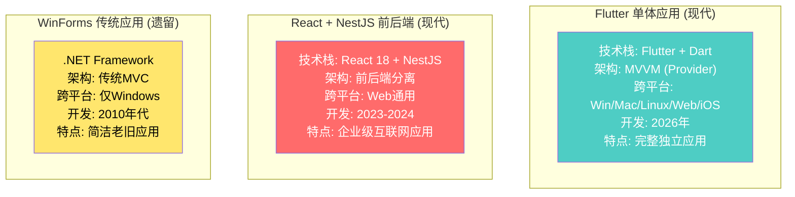
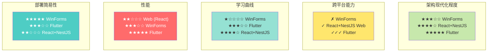

# 三个提词器项目架构对比分析

## 快速总览



---

## 一、架构模式对比

### 1. Flutter 应用 - MVVM (Provider 模式)

```
Model → ViewModel (Provider) → View
 ↑                              ↓
 ←————— 双向绑定 ←————————————
```

**特点**:
- ✓ 清晰的关注点分离
- ✓ Provider 粒度控制细粒度更新
- ✓ 易于单元测试
- ✗ 学习曲线（Provider、ChangeNotifier、MultiProvider）

**示例**:
```dart
// Model
class Article {
  final String id, title, content;
}

// ViewModel (Provider)
class ArticleProvider extends ChangeNotifier {
  List<Article> _articles = [];
  
  void addArticle(Article article) {
    _articles.add(article);
    notifyListeners();  // 触发重建
  }
}

// View
Consumer<ArticleProvider>(
  builder: (_, articleProvider, __) {
    return ListView(
      children: articleProvider.articles
        .map((a) => ArticleCard(article: a))
        .toList(),
    );
  },
)
```

---

### 2. React + NestJS - 前后端分离

```
Client (React)           Server (NestJS)
  ↓                           ↓
Redux                    Express.js
  ↓                           ↓
React Query ←→ Axios ←→ REST API
  ↓                           ↓
Components               Controllers
                              ↓
                         Services
                              ↓
                         Database (Drizzle ORM)
```

**特点**:
- ✓ 前后端独立部署、扩展
- ✓ 复杂应用友好（微服务基础）
- ✓ 团队分工清晰
- ✗ 复杂度高（前后端同步、API契约管理）
- ✗ 网络延迟（客户端-服务器往返）

**特色**:
- Redux 全局状态 + React Query 服务器状态（二层缓存）
- Radix UI 无样式原始组件库 + Tailwind 自由度高
- 企业级 NestJS 模块化架构

---

### 3. WinForms - 传统 MVC

```
User Interface (Forms)
         ↓
  Event Handlers
         ↓
Business Logic
         ↓
Data Layer (Registry/INI/XML)
```

**特点**:
- ✓ 结构简单，易上手
- ✓ 直接操作系统资源（Win32 API）
- ✓ 单进程，部署简单
- ✗ 仅 Windows（不跨平台）
- ✗ 技术老旧（.NET Framework 4.7.2）

---

## 二、关键特性对比

### 状态管理

| 项目             | 方案                      | 持久化                  | 复杂度 |
| ---------------- | ------------------------- | ----------------------- | ------ |
| **Flutter**      | Provider + ChangeNotifier | JSON文件 / localStorage | 中     |
| **React+NestJS** | Redux + React Query       | 数据库 + localStorage   | 高     |
| **WinForms**     | Form State + Registry     | Registry / INI 文件     | 低     |

### 本地存储

| 项目             | Desktop              | Web          | 机制                     |
| ---------------- | -------------------- | ------------ | ------------------------ |
| **Flutter**      | JSON文件 (~/.storm)  | localStorage | 统一 StorageService 包装 |
| **React+NestJS** | 服务器数据库         | localStorage | 前端缓存，后端为主       |
| **WinForms**     | Registry / INI / XML | N/A          | 多个存储源               |

### 用户界面

| 项目             | UI框架            | 特点               | 响应式        |
| ---------------- | ----------------- | ------------------ | ------------- |
| **Flutter**      | Material Design 3 | 组件化、跨平台一致 | ✓ 天然支持    |
| **React+NestJS** | Radix + Tailwind  | 极度可定制         | ✓ TailwindCSS |
| **WinForms**     | Win32 原生        | 系统风格、直观     | ❌ 固定布局    |

### 网络通信

| 项目             | 方案                        | 特点                 |
| ---------------- | --------------------------- | -------------------- |
| **Flutter**      | http 包 (可选)              | 简洁，仅用于模型下载 |
| **React+NestJS** | Axios                       | 请求拦截、转换链     |
| **WinForms**     | 原生 WebClient / HttpClient | 大部分时间不需要     |

---

## 三、核心功能实现对比

### 提词器播放引擎

#### Flutter 实现
```dart
class TeleprompterController {
  void updateScrollPosition(double deltaTime) {
    // 根据速度计算增量
    double pixelsPerSecond = fontSize * speed * SPEED_MULTIPLIER;
    double delta = pixelsPerSecond * (deltaTime / 1000);
    
    scrollPosition += delta;
    notifyListeners();
  }
}
```

**特点**: 
- Ticker (RequestAnimationFrame) 驱动
- Provider 通知 UI 重绘
- 支持暂停/继续无缝衔接

#### React 实现
```typescript
useEffect(() => {
  const interval = setInterval(() => {
    const pixelsPerSecond = fontSize * speed * SPEED_MULTIPLIER;
    const delta = pixelsPerSecond * (deltaTime / 1000);
    
    dispatch(updateScrollPosition(delta));
  }, 50);
  
  return () => clearInterval(interval);
}, [speed, fontSize, dispatch]);
```

**特点**:
- setInterval 定时驱动
- Redux dispatch 更新状态
- React Query 缓存配置项

#### WinForms 实现
```csharp
private Timer playbackTimer;

private void StartPlayback()
{
    playbackTimer = new Timer();
    playbackTimer.Interval = 50;  // 20fps
    playbackTimer.Tick += (sender, e) =>
    {
        double pixelsPerSecond = fontSize * speed * SPEED_MULTIPLIER;
        double delta = pixelsPerSecond * (playbackTimer.Interval / 1000.0);
        
        scrollPosition += delta;
        teleprompterControl.Invalidate();  // 手动重绘
    };
    playbackTimer.Start();
}
```

**特点**:
- System.Windows.Forms.Timer
- 手动调用 Invalidate() 重绘
- 同步事件处理

---

### 语音识别（ASR）

#### Flutter 方案
```dart
class AsrService extends ChangeNotifier {
  // 原生 Plugin 调用
  final sherpaOnnx = SherpaOnnx();
  
  Future<String> recognize() async {
    // 加载本地模型（支持镜像下载）
    await sherpaOnnx.loadModel(modelPath);
    
    // 流式识别
    final recognizer = sherpaOnnx.createRecognizer();
    while (hasAudioData) {
      final result = recognizer.processChunk(audioChunk);
      updateRecognitionState(result);
    }
  }
}
```

**特点**:
- 原生插件调用 (C++/Kotlin/Swift)
- 支持多种 ONNX 模型
- 镜像下载支持国内用户
- ChangeNotifier 可观察下载进度

#### React 方案
```typescript
const AsrWorker = new Worker('/sherpa-onnx-asr.js');  // WASM Worker

async function startRecognition() {
  // 加载 WASM 模型
  await workerInstance.init({
    modelPath: '/models/sherpa-zh-14m-int8',
  });
  
  // 发送音频块
  while (hasAudioData) {
    const result = await workerInstance.recognize(audioChunk);
    dispatch(updateRecognition(result));
  }
}
```

**特点**:
- WASM 运行在 Worker（非阻塞）
- 浏览器端完全处理
- 不依赖服务器

#### WinForms 方案
```csharp
// WinForms 中没有ASR集成
// 可通过 WebSocket 调用后端 Python 服务

socket.Send(audioChunk);
string result = socket.Receive();  // 识别结果
```

**特点**:
- 不内置 ASR
- 可调用外部服务
- 简单但依赖第三方

---

### 颜色主题系统

#### Flutter 方案（最优雅）
```dart
class AppTheme {
  static ThemeData fromColor(Color primary) {
    return ThemeData(
      useMaterial3: true,
      colorScheme: ColorScheme.fromSeed(seedColor: primary),
      // 自动生成所有相关颜色
    );
  }
}

// 使用
Consumer<SettingsProvider>(
  builder: (_, settings, __) {
    final primary = AppColors.primaryFromSettings(
      settings.settings.uiPrimaryColor
    );
    return MaterialApp(
      theme: AppTheme.fromColor(primary),
      // ...
    );
  },
)
```

**特点**:
- Material Design 3 自动生成配色方案
- 主题实时更新
- 所有组件自动适应

#### React 方案
```typescript
// Tailwind CSS 类名拼接或 CSS-in-JS
const themeClass = `bg-[${primaryColor}] text-white ...`;

// 更好的做法：CSS 变量
document.documentElement.style.setProperty(
  '--primary-color', 
  primaryColor
);

// 在 Tailwind 配置中定义
tailwind.config.js:
theme: {
  colors: {
    primary: 'var(--primary-color)',
  }
}
```

**特点**:
- 灵活但需手工管理
- CSS 变量动态主题
- Tailwind 需要 PostCSS 处理

#### WinForms 方案
```csharp
public static void ApplyTheme(Color primaryColor)
{
    mainForm.BackColor = primaryColor;
    mainForm.ForeColor = ComplementaryColor(primaryColor);
    
    // 手动更新所有控件
    foreach (Control control in mainForm.Controls)
    {
        control.BackColor = primaryColor;
    }
}
```

**特点**:
- 完全手工设置
- 无主题自动生成
- 需要递归遍历控件树

---

## 四、跨平台支持对比

### Flutter
```
✓ Windows    (window_manager, 全屏、标题栏控制)
✓ macOS      (Cocoa 原生)
✓ Linux      (GTK 原生)
✓ Web        (HTML5 Canvas)
✓ iOS/Android (移动版本)

兼容性: 统一代码库，一次编写到处运行
```

### React + NestJS
```
✓ Desktop Web  (Chrome、Firefox、Safari)
✓ Mobile Web   (响应式设计)
✓ 跨操作系统   (依赖浏览器)

限制: Web 无法本地存储模型、无法控制窗口
```

### WinForms
```
✓ Windows 7+
✗ macOS
✗ Linux
✗ Web
✗ Mobile

限制: 仅 Windows，不跨平台
```

---

## 五、开发体验对比

### 开发周期

| 项目             | 初始                      | 迭代              | 难度 |
| ---------------- | ------------------------- | ----------------- | ---- |
| **Flutter**      | 中等 (学习 Dart/Provider) | 快速 (热重载)     | 中等 |
| **React+NestJS** | 长 (前后端各自学习)       | 中等 (前后端联调) | 较高 |
| **WinForms**     | 快速 (拖拽设计)           | 快速 (即时反馈)   | 低   |

### 调试工具

| 项目             | 工具                                             |
| ---------------- | ------------------------------------------------ |
| **Flutter**      | DevTools、Flutter Inspector、Dart Analyzer       |
| **React+NestJS** | Chrome DevTools、Redux DevTools、NestJS Debugger |
| **WinForms**     | Visual Studio Debugger、Event Tracing            |

### 打包部署

| 项目             | 输出                | 大小      | 依赖             |
| ---------------- | ------------------- | --------- | ---------------- |
| **Flutter**      | .exe/.dmg/.deb/.apk | 50-150MB  | 最小             |
| **React+NestJS** | Docker镜像 + Web包  | 200-500MB | Node.js + 数据库 |
| **WinForms**     | .exe                | 5-20MB    | .NET Framework   |

---

## 六、代码复杂度对比

### 核心播放逻辑行数

```
Flutter:     ~200 行 (TeleprompterController)
React+NestJS: ~400 行 (Redux Slice + Service)
WinForms:    ~150 行 (Form Event Handler)
```

### 整体项目规模

```
Flutter:
  ├─ lib/          ~2500 行 (Dart)
  ├─ 单一语言
  └─ 跨 5 个平台

React+NestJS:
  ├─ client/       ~3000 行 (TypeScript + JSX)
  ├─ server/       ~2000 行 (TypeScript)
  ├─ 两种语言
  └─ 仅 Web

WinForms:
  ├─ open_teleprompt/ ~1500 行 (C#)
  ├─ 单一语言
  └─ 仅 Windows
```

---

## 七、生产环境对比

### 部署方式

**Flutter**:
- 独立可执行文件 (.exe / .dmg / .deb)
- 无外部依赖（除平台库）
- 用户直接运行

**React+NestJS**:
- 前端: CDN 分发 HTML/JS/CSS
- 后端: Docker 容器部署
- 需要服务器基础设施

**WinForms**:
- 单个 .exe
- 需要 .NET Framework
- 企业内网部署

### 监控与运维

| 项目             | 日志           | 性能                | 错误追踪         |
| ---------------- | -------------- | ------------------- | ---------------- |
| **Flutter**      | 本地日志文件   | 内置性能分析        | Sentry等第三方   |
| **React+NestJS** | Winston / Pino | APM工具 (New Relic) | Sentry / Datadog |
| **WinForms**     | Event Log      | 手工埋点            | 异常捕获后上报   |

---

## 八、选型建议

### 如果需要...

#### ✓ 跨平台应用 + 现代技术
→ **选择 Flutter**
- 一份代码支持 Win/Mac/Linux/Web/移动
- Material Design 3 现代 UI
- 性能卓越

#### ✓ 互联网 Web 应用 + 可视化编辑
→ **选择 React + NestJS**
- 企业级架构与工具链
- 团队分工清晰
- 技术生态丰富

#### ✓ Windows 专用 + 简单快速
→ **选择 WinForms**（仅作为遗留维护）
- 快速原型开发
- 学习曲线低
- 桌面应用标准

#### ✓ 内网办公应用 + 本地优先
→ **使用 Flutter + 本地数据库**
- Hive / Sqflite 作为离线数据库
- 跨平台支持公司的不同设备

---

## 九、迁移路径

### WinForms → Flutter
```
WinForms            Flutter
Control     →      Widget
Form        →      Page (Scaffold)
Event       →      Callback
Binding     →      Provider
Registry    →      json_serializable + file_storage
GDI         →      Canvas / CustomPaint
Win32 API   →      platform_channels (原生通道)
```

### React+NestJS → Flutter（部分）
```
React               Flutter
useState    →      State / Provider
useEffect   →      initState / dispose
Redux       →      Provider / Riverpod
Axios       →      http / Dio
Material-UI →      Material Design widgets
```

---

## 总结矩阵



